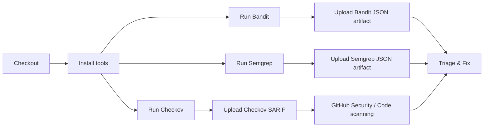

# 🛡️ OWASP Security Audit Workflow

[](https://github.com/Ahmadib12/owasp-security-audit/actions)
[](LICENSE)
[](https://owasp.org/www-project-top-ten/)

One-line: GitHub Actions workflow to run SAST and IaC security scans (Bandit, Semgrep, Checkov) and map findings to OWASP Top 10 risks.

Table of contents
- Quickstart
- Example GitHub Actions workflow
- What the tools do
- Uploading & triaging results
- Configuration & reducing noise
- Performance, security & permissions notes
- Mermaid flowchart (visual)
- References
- Contributing / License

---

## Quickstart (local)

Prerequisites
- Python 3.8+ (for Bandit & Semgrep)
- pip
- checkov (Python package)

Install
```bash
python -m pip install --upgrade pip
pip install bandit semgrep checkov
```

Run the scans locally
```bash
bandit -r . -f json -o bandit.json
semgrep --config "p/owasp-top-ten" --json --output semgrep.json .
checkov -d . --output sarif --output-file-path checkov_results.sarif
```

Expect output files:
- bandit.json
- semgrep.json
- checkov_results.sarif

---

## Example GitHub Actions workflow

Save this as `.github/workflows/owasp-scan.yml` to run in CI.

```yaml
name: OWASP Top 10 Security Audit

on:
  push:
    branches: ["main", "master", "develop"]
  pull_request:
    branches: ["main", "master", "develop"]
  schedule:
    - cron: '0 3 * * *' # nightly

permissions:
  contents: read
  security-events: write

jobs:
  owasp-sast-scan:
    name: OWASP Code & IaC Security Scan
    runs-on: ubuntu-latest
    steps:
      - name: Checkout source
        uses: actions/checkout@v4

      - name: Set up Python
        uses: actions/setup-python@v4
        with:
          python-version: '3.x'

      - name: Install scanners
        run: |
          python -m pip install --upgrade pip
          pip install bandit semgrep checkov

      - name: Run Bandit (JSON)
        run: bandit -r . -f json -o bandit.json || true

      - name: Run Semgrep (OWASP rules)
        run: semgrep --config "p/owasp-top-ten" --json --output semgrep.json . || true

      - name: Run Checkov (SARIF)
        run: checkov -d . --output sarif --output-file-path checkov_results.sarif || true

      - name: Upload artifacts
        uses: actions/upload-artifact@v4
        with:
          name: security-scan-results
          path: |
            bandit.json
            semgrep.json
            checkov_results.sarif

      - name: Upload SARIF to GitHub (for Code scanning)
        if: always()
        uses: github/codeql-action/upload-sarif@v2
        with:
          sarif_file: checkov_results.sarif
```

Notes:
- `|| true` ensures scans don't fail the job due to non-zero exit codes caused by findings; remove if you want failures to block merges.
- Semgrep can produce SARIF via `--output-file` + converter or via newer Semgrep flags — check Semgrep docs to upload SARIF directly if supported.

---

## What each tool covers (mapping to OWASP Top 10)

- Bandit (Python) — looks for insecure code patterns, weak crypto usage, and common Python issues.
  - Example mapping: A02 Cryptographic Failures, A03 Injection.
- Semgrep — rule-based static analysis with OWASP Top 10 policy packs.
  - Example mapping: A03 Injection, A04 Insecure Design, A08 Software Integrity Failures.
- Checkov — IaC scanning for Terraform, Kubernetes, Dockerfiles, CloudFormation.
  - Example mapping: A05 Security Misconfiguration, A07 Identification & Authentication Failures.

---

## Uploading & triaging results

Where results appear
- Artifacts: JSON/SARIF files are saved as workflow artifacts and can be downloaded for manual triage.
- SARIF uploads: SARIF files are uploaded to GitHub's Code scanning / Security tab, surfacing findings directly in PRs and the Security UI.

Triage guidance
- Prioritize by severity:
  - Critical → fix immediately or block merge.
  - High → plan a hotfix or include in next sprint.
  - Medium/Low → schedule or suppress if false positive.
- For noisy repositories: create a baseline by running scans locally, triaging findings, and adding ignores for accepted items (see "Configuration & reducing noise").

Recording context in PRs
- Add a short note linking to scan artifacts and relevant Security alerts in the PR description so reviewers can verify fixes.

---

## Configuration & reducing noise

Semgrep
- .semgrep.yml example: customize which rules to enable/disable and set severities.
- .semgrepignore: exclude vendor/, third_party/, migrations/, or generated files.

Bandit
- Use `bandit -r . -x path/to/exclude` or create a bandit config to ignore certain tests.

Checkov
- Use `--skip-check` to skip specific checks or create `.checkov.yml` to define skip lists.

Example .semgrepignore
```
vendor/
third_party/
migrations/
node_modules/
```

Baseline approach
1. Run scans locally.
2. Triage and suppress clear false positives in config files.
3. Commit suppression/config and re-run CI.
4. Periodically revisit suppressions.

---

## Performance & security notes

Performance
- Avoid running heavy scans on every small commit: run full scans on schedule or on main; run targeted scans on PRs.
- Limit scan scope using path filters (e.g., `paths-ignore` or semgrep include/exclude).

Security
- Keep workflow permissions minimal (you already use contents: read, security-events: write).
- Never print secrets or credentials in logs; use GitHub Secrets for any credentials required by auxiliary tests.

Costs & runner time
- Installing scanners each run increases runtime — consider caching or using a custom Docker image with tools preinstalled.

---

## Mermaid flowchart (visual)

If README is rendered on a platform that supports Mermaid, paste the following block to get a visual flow.



---

## Common troubleshooting

- Semgrep returns exit code !=0 on regex or rule errors — review semgrep output and rule configuration.
- SARIF upload fails: ensure SARIF file is valid and the `github/codeql-action/upload-sarif` step can access it.
- Scans take too long: restrict to changed paths in PRs or use nightly full scans.

---

## References

- OWASP Top 10: https://owasp.org/www-project-top-ten/
- Bandit docs: https://bandit.readthedocs.io/
- Semgrep docs: https://semgrep.dev/docs/
- Checkov docs: https://www.checkov.io/
- GitHub SARIF upload: https://docs.github.com/en/code-security/code-scanning/automatically-uploading-sarif-results-to-github

---

## Contributing

Contributions welcome — please open issues or PRs for:
- New rules or config improvements
- Better triage guidance or automation
- Performance optimizations

---

## License

This repository is provided under the MIT License. See LICENSE.
