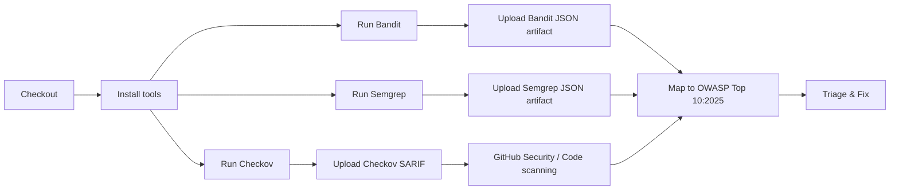

# 🛡️ OWASP Security Audit Workflow

[](https://github.com/Ahmadib12/owasp-security-audit/actions)
[](LICENSE)
[](https://owasp.org/www-project-top-ten/)

One-line: GitHub Actions workflow and local tooling to run SAST and IaC scans (Bandit, Semgrep, Checkov) and map findings to OWASP Top 10:2025 risks.

Table of contents
- [Quickstart (local)](#quickstart-local)
- [Example GitHub Actions workflow](#example-github-actions-workflow)
- [What the tools cover (mapping to OWASP Top 10:2025)](#what-the-tools-cover-mapping-to-owasp-top-102025)
- [OWASP Top 10:2025 Categories & CWE Mappings](#owasp-top-102025-categories--cwe-mappings)
- [Uploading & triaging results](#uploading--triaging-results)
- [Configuration & reducing noise](#configuration--reducing-noise)
- [Baseline & workflow for noisy repos](#baseline--workflow-for-noisy-repos)
- [Interpreting findings](#interpreting-findings)
- [Performance, security & permissions notes](#performance-security--permissions-notes)
- [Mermaid flowchart (visual)](#mermaid-flowchart-visual)
- [References](#references)
- [Contributing & Security](#contributing--security)
- [License](#license)

---

## Quickstart (local)

Prerequisites
- Python 3.8+ (Bandit, Semgrep)
- pip
- checkov (Python package)

Install
```bash
python -m pip install --upgrade pip
pip install bandit semgrep checkov
```

Run scans locally (examples)
```bash
# Bandit (JSON)
bandit -r . -f json -o bandit.json || true

# Semgrep (OWASP policy pack)
semgrep --config "p/owasp-top-ten" --json --output semgrep.json . || true

# Checkov (SARIF)
checkov -d . --output sarif --output-file-path checkov_results.sarif || true
```

Expect output files:
- bandit.json
- semgrep.json
- checkov_results.sarif

Quick tip: run scans against changed paths in PRs to reduce noise and runtime.

---

## Example GitHub Actions workflow

Save as `.github/workflows/owasp-scan.yml`.

Notes included in the workflow:
- Cache pip to reduce repeated installs.
- Limit permissions to minimal required.
- Use `|| true` on scan commands when you want findings to not fail the job.
- Upload artifacts and SARIF only when produced.

```yaml
name: OWASP Top 10:2025 Security Audit

on:
  push:
    branches: ["main", "master", "develop"]
  pull_request:
    branches: ["main", "master", "develop"]
  schedule:
    - cron: '0 3 * * *' # nightly

permissions:
  contents: read
  security-events: write

jobs:
  owasp-sast-scan:
    name: OWASP Code & IaC Security Scan (2025)
    runs-on: ubuntu-latest
    steps:
      - name: Checkout source
        uses: actions/checkout@v4

      - name: Set up Python
        uses: actions/setup-python@v4
        with:
          python-version: '3.x'

      - name: Cache pip
        uses: actions/cache@v4
        with:
          path: ~/.cache/pip
          key: ${{ runner.os }}-pip-${{ hashFiles('**/requirements.txt') }}
          restore-keys: |
            ${{ runner.os }}-pip-

      - name: Install scanners
        run: |
          python -m pip install --upgrade pip
          pip install bandit semgrep checkov

      - name: Run Bandit (JSON)
        run: bandit -r . -f json -o bandit.json || true

      - name: Run Semgrep (OWASP rules)
        run: semgrep --config "p/owasp-top-ten" --json --output semgrep.json . || true

      - name: Run Checkov (SARIF)
        run: checkov -d . --output sarif --output-file-path checkov_results.sarif || true

      - name: Upload artifacts
        if: always()
        uses: actions/upload-artifact@v4
        with:
          name: security-scan-results
          path: |
            bandit.json
            semgrep.json
            checkov_results.sarif
          retention-days: 14

      - name: Upload SARIF to GitHub (for Code scanning)
        if: ${{ always() }}
        uses: github/codeql-action/upload-sarif@v2
        with:
          sarif_file: checkov_results.sarif
```

(If you prefer conditional SARIF upload only when a file exists, add a preceding step to set an output or check for the file and use that in the `if:`.)

---

## What the tools cover (mapping to OWASP Top 10:2025)

- **Bandit** (Python) — identifies insecure code patterns, weak cryptography, and Python-specific vulnerabilities.
  - Maps to: A04 Cryptographic Failures, A05 Injection, A07 Authentication Failures.
- **Semgrep** — rule-based static analysis with OWASP Top 10:2025 policy packs.
  - Maps to: A01 Broken Access Control, A05 Injection, A06 Insecure Design, A08 Software or Data Integrity Failures.
- **Checkov** — Infrastructure-as-Code (IaC) scanning for Terraform, Kubernetes, Dockerfiles, CloudFormation, and cloud policies.
  - Maps to: A02 Security Misconfiguration, A03 Software Supply Chain Failures, A07 Authentication Failures.

For detailed CWE mappings, see [OWASP-CWE-Mapping.md](OWASP-CWE-Mapping.md).

---

## OWASP Top 10:2025 Categories & CWE Mappings

| Rank | Category | Primary CWEs | Common Findings |
|------|----------|--------------|-----------------|
| **A01:2025** | Broken Access Control | CWE-284, CWE-285, CWE-639 | Authorization bypass, missing ACL checks, insecure direct object references |
| **A02:2025** | Security Misconfiguration | CWE-16, CWE-611, CWE-250 | Default credentials, exposed debug endpoints, misconfigured services, XXE |
| **A03:2025** | Software Supply Chain Failures | CWE-1104, CWE-494, CWE-829 | Unmaintained dependencies, dependency tampering, unsigned downloads |
| **A04:2025** | Cryptographic Failures | CWE-327, CWE-328, CWE-311 | Weak algorithms/hashes, missing encryption at rest/in transit |
| **A05:2025** | Injection | CWE-89, CWE-94, CWE-77 | SQL injection, code/eval injection, command injection |
| **A06:2025** | Insecure Design | CWE-209, CWE-693, CWE-840 | Architectural flaws, business-logic weaknesses, missing threat model mitigations |
| **A07:2025** | Authentication Failures | CWE-287, CWE-613, CWE-798 | Broken/insufficient authentication, weak sessions, hard-coded credentials |
| **A08:2025** | Software or Data Integrity Failures | CWE-494, CWE-1104, CWE-347 | Unsigned updates, tampered data, unvalidated deserialization |
| **A09:2025** | Security Logging and Alerting Failures | CWE-778, CWE-223 | Missing/insufficient logs, no alerting on suspicious activity |
| **A10:2025** | Mishandling of Exceptional Conditions | CWE-703, CWE-391, CWE-209 | Unchecked errors, unsafe exception handling, information exposure via errors |

> **Note:** This mapping aligns with [OWASP Top 10:2025](https://owasp.org/www-project-top-ten/). For detailed CWE definitions and tool-specific coverage, see [OWASP-CWE-Mapping.md](OWASP-CWE-Mapping.md).

---

## Uploading & triaging results

Where results appear
- Artifacts: JSON/SARIF files are saved as workflow artifacts and can be downloaded for manual triage.
- SARIF uploads: SARIF files are uploaded to GitHub's Code scanning / Security tab, surfacing findings in PRs and the Security UI.

Triage guidance
- Prioritize by severity and OWASP category:
  - Critical → fix immediately or block merge.
  - High → plan a hotfix or include in the next sprint.
  - Medium/Low → schedule or suppress if false positive.
- Map findings to OWASP Top 10:2025 categories using the table above and [OWASP-CWE-Mapping.md](OWASP-CWE-Mapping.md).
- For noisy repos: create a baseline by running scans locally, triaging findings, and adding ignores for accepted items (see "Configuration & reducing noise").

Recording context in PRs
- Add a short note linking to scan artifacts and Security alerts in the PR description so reviewers can verify fixes.
- Example: link to workflow run artifacts and include the top 3 findings summary, categorized by OWASP Top 10:2025.

---

## Configuration & reducing noise

Semgrep
- Example `.semgrep.yml` snippet to set severities and rules (customize to repo needs).
```yaml
rules:
  - id: experimental-rule
    patterns: ...
    severity: INFO
    message: "..."
```

- `.semgrepignore` example:
```
vendor/
third_party/
migrations/
node_modules/
```

Bandit
- Exclude paths:
```bash
bandit -r . -x path/to/exclude -f json -o bandit.json
```
- Or configure a bandit config file to ignore specific tests.

Checkov
- Create `.checkov.yml` to skip checks or configure paths; or use `--skip-check` CLI options.

Baseline approach
1. Run scans locally against a full checkout.
2. Triage and suppress clear false positives in config files (committed to a branch).
3. Commit suppression/config and re-run CI.
4. Periodically revisit suppressions to avoid staleness.

---

## Baseline & workflow for noisy repos

1. Run full scans in an isolated branch and save artifacts.
2. Triage externally (spreadsheet or issue tracker) and generate suppression lists.
3. Map findings to OWASP Top 10:2025 categories using CWE identifiers.
4. Add suppressions to repository config (.semgrep.yml, .checkov.yml, Bandit config).
5. Switch CI to run targeted scans on PRs (changed files) and full scans on schedule.

---

## Interpreting findings

- SARIF/JSON fields to check: file path, line numbers, rule id, severity, and code snippet.
- Map findings to OWASP Top 10:2025 using CWE IDs — consult [OWASP-CWE-Mapping.md](OWASP-CWE-Mapping.md).
- False positives happen: check context, search for tests/third-party code, and consider suppressing only after careful review.
- Consider linking each major fix to a security issue/PR to track remediation and rationale, including the OWASP category addressed.

---

## Performance, security & permissions notes

Performance
- Avoid running heavy scans on every small commit: run full scans nightly and targeted scans on PRs.
- Use pip caching or a custom runner image with preinstalled scanners.

Security
- Keep workflow permissions minimal.
- Never print secrets or credentials in logs; use GitHub Secrets for any credentials.
- Validate security findings against OWASP Top 10:2025 standards before merge.

Costs & runner time
- Installing scanners each run increases runtime — consider caching or prebuilt images.

---

## Mermaid flowchart (visual)



---

## Common troubleshooting

- Semgrep returns exit code !=0 on regex or rule errors — review semgrep output and rule configuration.
- SARIF upload fails: ensure SARIF file is valid and the `github/codeql-action/upload-sarif` step can access it.
- Scans take too long: restrict to changed paths in PRs or use nightly full scans.
- Finding not mapping to OWASP category? Consult [OWASP-CWE-Mapping.md](OWASP-CWE-Mapping.md) and cross-reference by CWE ID.

---

## References

- [OWASP Top 10:2025](https://owasp.org/www-project-top-ten/)
- [OWASP-CWE-Mapping.md](OWASP-CWE-Mapping.md) — detailed CWE mappings for this project
- [Bandit docs](https://bandit.readthedocs.io/)
- [Semgrep docs](https://semgrep.dev/docs/)
- [Checkov docs](https://www.checkov.io/)
- [GitHub SARIF upload](https://docs.github.com/en/code-security/code-scanning/automatically-uploading-sarif-results-to-github)
- [MITRE CWE Top 25](https://cwe.mitre.org/top25/)

---

## Contributing & Security

Contributions welcome — open issues or PRs for:
- New rules or config improvements aligned with OWASP Top 10:2025
- Better triage guidance or automation
- Performance optimizations
- CWE mapping enhancements

Security disclosure
- If you find a security issue with this workflow or the repository, please follow our [SECURITY.md](SECURITY.md) or open a private disclosure issue.

---

## License

This repository is provided under the MIT License. See LICENSE.
